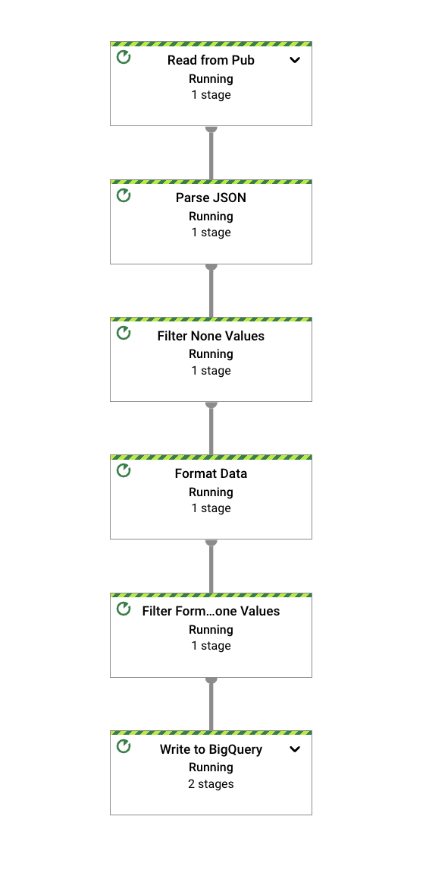
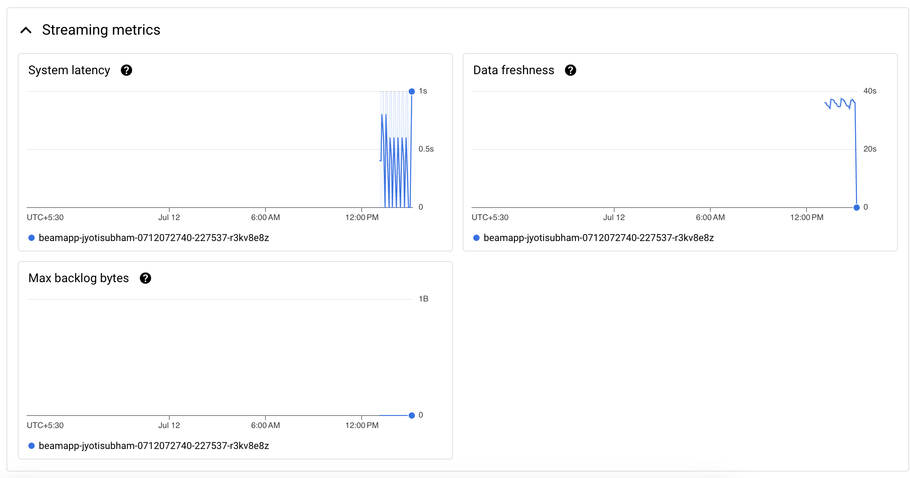

# Google Cloud Dataflow Pipeline Project

## Overview
This project demonstrates a real-time data processing pipeline using Google Cloud Dataflow. The pipeline ingests data from Pub/Sub, processes it using Apache Beam, and stores the results in BigQuery. This README provides step-by-step instructions to set up the project environment, deploy the Dataflow job, and monitor its performance.

## Table of Contents

#### 1. Project Setup

- Create a Google Cloud Project

- Enable Necessary APIs

- Set Up Cloud Storage Buckets

- Create Pub/Sub Topics

- Prepare BigQuery Dataset

- Deploying and Monitoring the Dataflow Pipeline

#### 2. Write and Test Dataflow Pipeline Code

- Deploy Dataflow Job

- Monitor Dataflow Job

#### 3. Additional Resources

- Troubleshooting

- Scaling and Optimization

- Cleaning Up

## 1. Project Setup

#### 1.1 Create a Google Cloud Project

Create a new Google Cloud Project named your-project-name:

(gcloud projects create your-project-name --name="Your Project Name")

#### 1.2 Enable Necessary APIs

Enable the required APIs for Google Cloud Dataflow, Pub/Sub, and BigQuery:

(gcloud services enable dataflow.googleapis.com pubsub.googleapis.com bigquery.googleapis.com)

#### 1.3 Set Up Cloud Storage Buckets

Create Cloud Storage buckets for Dataflow temp and staging locations:

(gsutil mb gs://your-dataflow-bucket/tmp
gsutil mb gs://your-dataflow-bucket/staging)

#### 1.4 Create Pub/Sub Topics

Create Pub/Sub topics for data ingestion:

(gcloud pubsub topics create your-topic-name)

#### 1.5 Prepare BigQuery Dataset

Create a BigQuery dataset for storing processed data:

(bq mk --dataset your-project-id:your_dataset_name)

## 2. Deploying and Monitoring the Dataflow Pipeline

#### 2.1 Write and Test Dataflow Pipeline Code

Write your Dataflow pipeline code using Apache Beam in Python. Test locally using DirectRunner:

(python dataflow_pipeline.py)

#### 2.2 Deploy Dataflow Job

Deploy the Dataflow pipeline to Google Cloud Platform:

(python dataflow_pipeline.py \
    --project=your-project-id \
    --runner=DataflowRunner \
    --region=your-region \
    --temp_location=gs://your-dataflow-bucket/tmp \
    --staging_location=gs://your-dataflow-bucket/staging \
    --input_topic=projects/your-project-id/topics/your-topic-name \
    --output_bigquery=your-project-id:your_dataset_name.output_table)

#### 2.3 Monitor Dataflow Job

Monitor the deployed Dataflow job in the Google Cloud Console:

- Go to the Dataflow section in the GCP Console.

- Click on your running job to view details.

- Monitor the job's progress, errors, and performance metrics.

#### 2.4 Images

- CPU utilization

- JOB

- LATENCY

- JOB MAP

- STREAMING MATRICS

## 3. Additional Resources

#### 3.1 Troubleshooting

For troubleshooting common issues with Dataflow jobs, refer to the Google Cloud Dataflow troubleshooting guide.

#### 3.2 Scaling and Optimization

Learn about scaling and optimizing Dataflow pipelines for performance and cost efficiency in the Dataflow documentation.

#### 3.3 Cleaning Up

After completing your tasks, clean up resources to avoid unnecessary charges:

(gcloud projects delete your-project-id) #To avoid billings

This README.md file provides comprehensive instructions to set up, deploy, and monitor a Google Cloud Dataflow pipeline. Adjust parameters and specifics according to your project's requirements and configurations.

